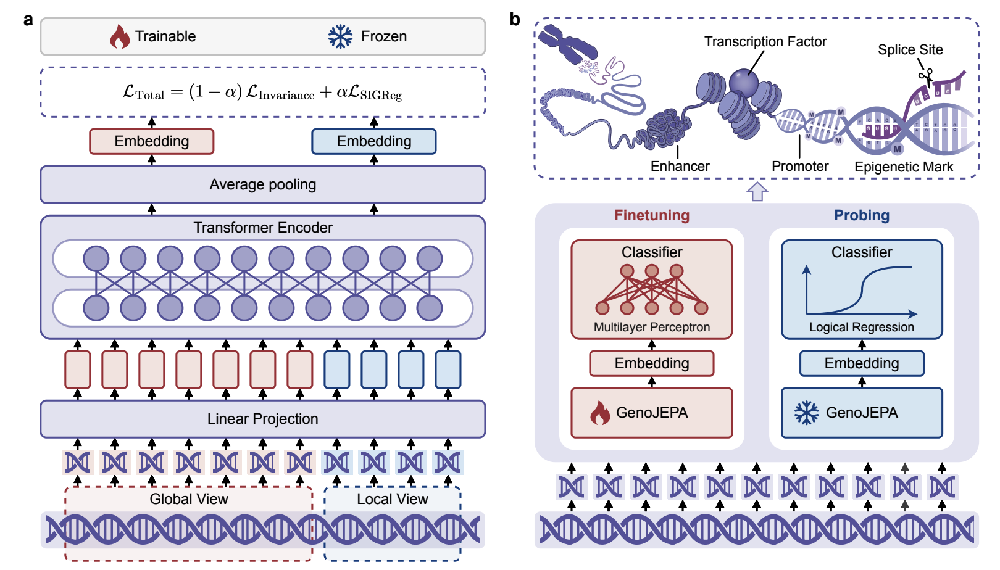
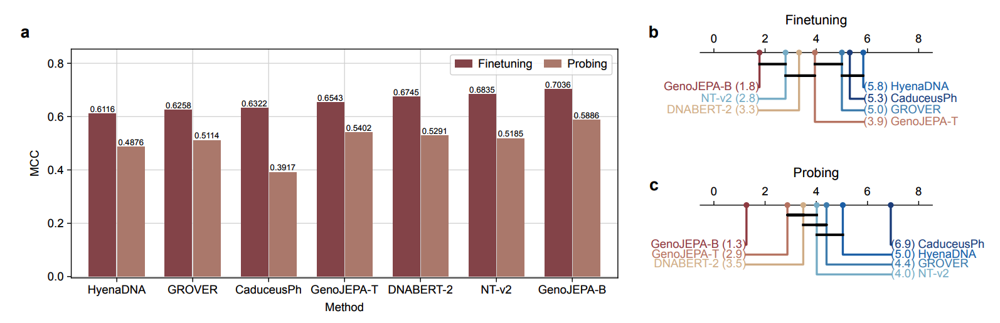
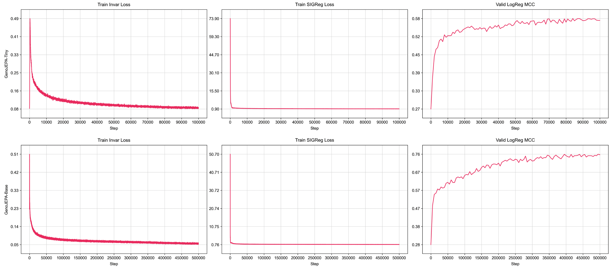

<div align="center">

# GenoJEPA: From Nucleotides to Semantics 

<a href="https://www.biorxiv.org/content/10.64898/2026.04.02.716255v1.abstract"></a>
<a href="https://huggingface.co/datasets/ChengsenWang/GenoJEPA-Pretraining"></a>
<a href="https://huggingface.co/datasets/ChengsenWang/GenoJEPA-Evaluation"></a>
<a href="https://huggingface.co/ChengsenWang/GenoJEPA-Tiny"></a>
<a href="https://huggingface.co/ChengsenWang/GenoJEPA-Base"></a>

</div>

## ✨ Introduction

Decoding the regulatory syntax encoded in genomic sequences is a central objective in computational biology. Most existing genomic foundation models treat DNA as a language and adopt pretraining objectives from natural language processing. DNA sequences, however, lack explicit semantic boundaries and contain substantial evolutionary noise. Nucleotide-level reconstruction in a low-dimensional input space can therefore increase computational overhead and may yield representations with limited discriminative capacity. Downstream tasks often depend on expensive finetuning, which restricts practical use in many biology laboratories. Here we present GenoJEPA, a genomic representation learning framework based on joint-embedding predictive architecture. GenoJEPA combines continuous patching with semantic alignment, shifting the optimization from local base reconstruction to semantic alignment in latent space. Across 55 downstream tasks, GenoJEPA shows strong representational capacity and robust generalization while reducing parameter count and computational cost. The resulting semantic vectors from frozen GenoJEPA support lightweight GPU-free classifiers to achieve competitive accuracy. These results suggest a practical route towards efficient training and broad application of larger-scale genomic foundation models.



## 📊 Results

GenoJEPA is evaluated across 55 genomic downstream tasks with both fine-tuning and frozen-embedding probing protocols.



Training curves for GenoJEPA-Tiny and GenoJEPA-Base are provided below.



## 🧬 Model

GenoJEPA uses a simple DNA tokenizer over `A/T/C/G/N`, continuous patching, a Transformer encoder, and JEPA-style semantic alignment between augmented sequence views. The repository provides both pre-training and downstream evaluation pipelines:

- **Pre-training**: train GenoJEPA with global/local DNA views and latent-space alignment.
- **Fine-tuning**: attach a classification head and optimize on downstream genomic sequence classification tasks.
- **Probing**: freeze GenoJEPA, extract sequence embeddings, and train lightweight classifiers such as Logistic Regression.

| Model | Hidden size | Layers | Attention heads | Training steps | Checkpoint |
| --- | ---: | ---: | ---: | ---: | --- |
| GenoJEPA-Tiny | 384 | 4 | 12 | 100K | [ChengsenWang/GenoJEPA-Tiny](https://huggingface.co/ChengsenWang/GenoJEPA-Tiny) |
| GenoJEPA-Base | 512 | 12 | 16 | 500K | [ChengsenWang/GenoJEPA-Base](https://huggingface.co/ChengsenWang/GenoJEPA-Base) |

You can load the released checkpoints directly with `transformers` by setting `trust_remote_code=True`.

## 💾 Dataset

| Resource | Link | Notes |
| --- | --- | --- |
| GenoJEPA-Pretraining | [Hugging Face Dataset](https://huggingface.co/datasets/ChengsenWang/GenoJEPA-Pretraining) | Pre-training metadata/statistics and processed DNA sequence resources. |
| GenoJEPA-Evaluation | [Hugging Face Dataset](https://huggingface.co/datasets/ChengsenWang/GenoJEPA-Evaluation) | 55 downstream genomic sequence classification tasks in Parquet format. |

The default configuration expects the following layout:

```text
dataset/
├── GenoJEPA-Pretraining/
│   ├── statistics.csv
│   └── DNA_4K_Tokenized/
│       ├── *.tar
│       └── ...
└── GenoJEPA-Evaluation/
    ├── statistics.csv
    └── <Benchmark>/<Task>/
        ├── train.parquet
        └── test.parquet
```

Each downstream task is selected by `eval_idx` from `dataset/GenoJEPA-Evaluation/statistics.csv`. The default `eval_idx=54` points to `nucleotide_transformer_tasks/splice_site_donor`.

## 🚀 Usage

### 1. Extract Sequence Embeddings

Use GenoJEPA as a general-purpose DNA sequence encoder:

```python
import torch
from transformers import AutoModel, AutoTokenizer

model_name_or_path = "ChengsenWang/GenoJEPA-Tiny"  # or "ChengsenWang/GenoJEPA-Base"

tokenizer = AutoTokenizer.from_pretrained(model_name_or_path, trust_remote_code=True)
model = AutoModel.from_pretrained(model_name_or_path, trust_remote_code=True)

if torch.cuda.is_available():
    model = model.cuda()

sequences = [
    "ACGTACGTNNNNACGTACGT",
    "TTGCAAGTCCGATCGATCGA",
]

embeddings = model.encode(sequences, tokenizer=tokenizer, batch_size=64)
print(embeddings.shape)  # (number_of_sequences, hidden_size)
```

For local checkpoints produced by this repository, replace `model_name_or_path` with `./output/GenoJEPA-Tiny` or `./output/GenoJEPA-Base`.

### 2. Classify Frozen Embeddings

A typical GPU-free downstream workflow is to freeze GenoJEPA, extract embeddings, and train a lightweight classifier:

```python
import torch
from sklearn.linear_model import LogisticRegression
from sklearn.metrics import accuracy_score, f1_score, matthews_corrcoef
from transformers import AutoModel, AutoTokenizer

model_name_or_path = "ChengsenWang/GenoJEPA-Tiny"

tokenizer = AutoTokenizer.from_pretrained(model_name_or_path, trust_remote_code=True)
model = AutoModel.from_pretrained(model_name_or_path, trust_remote_code=True)

if torch.cuda.is_available():
    model = model.cuda()

train_sequences = ["ACGTACGTACGT", "TTTTCCCCAAAA", "GGGGAAAACCCC"]
train_labels = [0, 1, 1]
test_sequences = ["ACGTACGTAAAA", "TTTTGGGGCCCC"]
test_labels = [0, 1]

train_embeddings = model.encode(train_sequences, tokenizer=tokenizer, batch_size=64)
test_embeddings = model.encode(test_sequences, tokenizer=tokenizer, batch_size=64)

classifier = LogisticRegression(random_state=42)
classifier.fit(train_embeddings, train_labels)
predictions = classifier.predict(test_embeddings)

print("ACC:", accuracy_score(test_labels, predictions))
print("MCC:", matthews_corrcoef(test_labels, predictions))
print("F1:", f1_score(test_labels, predictions, average="macro"))
```

The repository's `probing.py` extends this idea to full benchmark tasks and compares KNN, Logistic Regression, and CatBoost classifiers.

### 3. Pre-train GenoJEPA Models

Build the DNA tokenizer:

```bash
python tokenization.py --tokenizer_dir ./output/tokenizer/
```

Train GenoJEPA-Tiny:

```bash
python pretraining.py --config_path ./config/pretraining_config_tiny.yaml
```

Train GenoJEPA-Base:

```bash
python pretraining.py --config_path ./config/pretraining_config_base.yaml
```

The default pre-training configs read tokenized WebDataset tar files from `./dataset/GenoJEPA-Pretraining/DNA_4K_Tokenized/`, validate on `./dataset/GenoJEPA-Evaluation/`, and save final models to `./output/GenoJEPA-Tiny` or `./output/GenoJEPA-Base`.

> **Note:** the training scripts recreate the configured model/checkpoint output directories. Back up existing outputs before re-running pre-training.

### 4. Fine-tune Downstream Tasks

Run downstream fine-tuning on a selected benchmark task:

```bash
python finetuning.py \
  --config_path ./config/finetuning_config.yaml \
  --params_path ./config/finetuning_params_tiny.csv \
  --eval_idx 54
```

The fine-tuning script loads `AutoModelForSequenceClassification` from `model_dir`, chooses task-specific hyperparameters from the corresponding CSV file, and reports ACC, MCC, and macro-F1.

To fine-tune GenoJEPA-Base, update `model_dir` in `config/finetuning_config.yaml` to `./output/GenoJEPA-Base` and use `./config/finetuning_params_base.csv`.

### 5. Probe Frozen Embeddings

Evaluate frozen GenoJEPA embeddings with classical classifiers:

```bash
python probing.py \
  --config_path ./config/probing_config.yaml \
  --eval_idx 54
```

The probing script loads `AutoModel`, extracts embeddings with `model.encode(...)`, and evaluates KNN, Logistic Regression, and CatBoost classifiers.

## 📁 Repository

```text
GenoJEPA/
├── config/
│   ├── pretraining_config_tiny.yaml      # Tiny pre-training configuration
│   ├── pretraining_config_base.yaml      # Base pre-training configuration
│   ├── finetuning_config.yaml            # Downstream fine-tuning configuration
│   ├── probing_config.yaml               # Frozen-embedding probing configuration
│   ├── finetuning_params_tiny.csv        # Task-wise Tiny fine-tuning hyperparameters
│   └── finetuning_params_base.csv        # Task-wise Base fine-tuning hyperparameters
├── dataset/
│   ├── GenoJEPA-Pretraining/             # Pre-training statistics and tokenized tar files
│   └── GenoJEPA-Evaluation/              # Evaluation statistics and task parquet files
├── image/
│   ├── method.png                        # Method overview
│   ├── result.png                        # Downstream results
│   └── log.png                           # Training curves
├── log/                                  # Released training logs
├── output/                               # Tokenizer and model outputs
├── preprocessing/                        # FASTA splitting, shuffling, and tokenization tools
├── utils/
│   ├── model.py                          # GenoJEPA model definitions and HF AutoModel mapping
│   └── tokenizer.py                      # DNA tokenizer implementation
├── tokenization.py                       # Build and save tokenizer
├── pretraining.py                        # GenoJEPA pre-training entry point
├── finetuning.py                         # Downstream fine-tuning entry point
├── probing.py                            # Frozen embedding probing entry point
└── requirements.txt
```

## 📝 Citation

If you find GenoJEPA useful in your research, please cite our paper:

```bibtex
@article {
    author  = {Wang, Chengsen and Qi, Qi and Sun, Haifeng and Zhuang, Zirui and He, Bo and Liu, Siying and Liao, Jianxin and Wang, Jingyu},
    title   = {From nucleotides to semantics: genomic representation learning via joint-embedding predictive architecture},
    journal = {bioRxiv},
    year    = {2026},
}
```

## 📪 Contact

If you have any questions about the paper, datasets, checkpoints, or code, please open an issue or contact the authors through [cswang@bupt.edu.cn](mailto:cswang@bupt.edu.cn).
